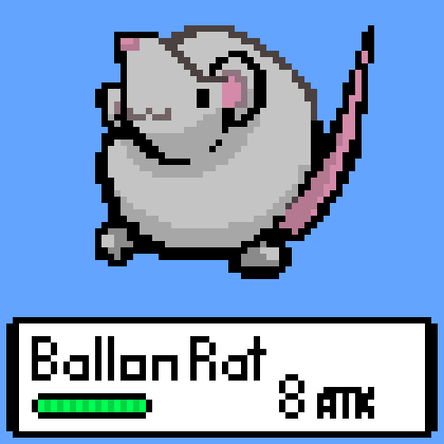

# Text-based RPG

Text-based RPG on Java (will be developed into picture-based with interactive UI)
Started at September 11th, 2020

## Pictures
&nbsp; 

## Contributors
Project Manager(PM) by Jaeyoung Shin

Software Developer(SD) by Jonathan Lee

Creative Director(CD) by Hyeongjun Song

## Installation guide for starters
1. Download vscode java installation and java extension pack from <https://code.visualstudio.com/docs/languages/java>

2. Download git from <https://git-scm.com/downloads>

3. Download the liveshare extension pack in extension pack in VScode.

4. Create new branch and open respositroy and get to work!

## Setting
See [settingFile.md](settingFile.md)

https://drive.google.com/file/d/1eXL4-6aVPqakbfQ3Ypk9Yic0peBJ1nV4/view?usp=sharing

## Dialogue rule
one dash for NPC talking

no dash for main character/internal dialogue

two dash for narration

| for system message
